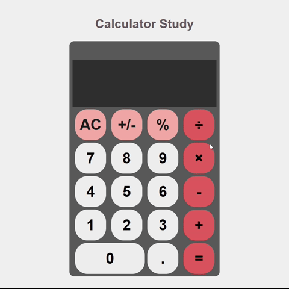

<section>

# 🧮 Calculator Study

# About the project

Create a basic functioning calculator using HTML, CSS, and JavaScript.

## 🧩 Features and Requirements:
Use HTML for structure.

Use CSS for basic styling.

Use JavaScript for logic and interactivity.

Code should be modular and readable.

Clean, readable design and typography

Perform basic operations: Addition, Subtraction, Multiplication, Division.

Display input and results on the screen.

Allow users to clear the current input.

Prevent invalid input (e.g., multiple operators in a row).

Handle division by zero with an appropriate message.

</section>
